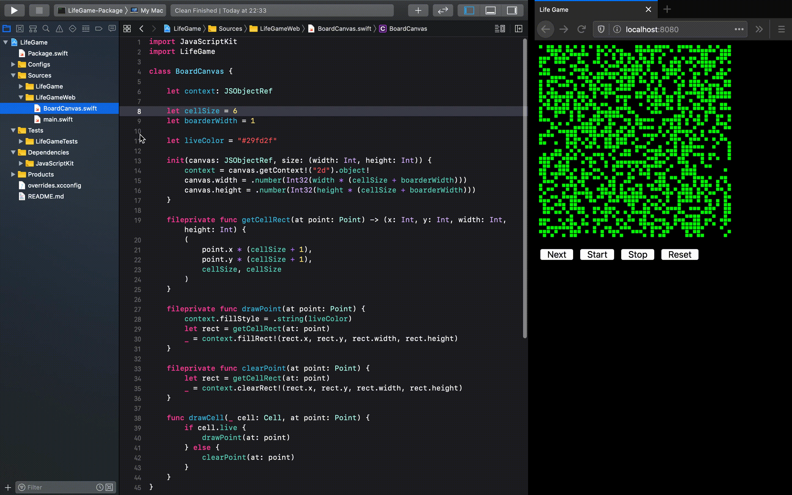

# LifeGame with SwiftWasm

https://life-game-with-swiftwasm.netlify.com/

**:warning: Please wait 15sec while loading**

## Requirements

- [kylef/swiftenv: Swift Version Manager](https://github.com/kylef/swiftenv)

## Bootstrap

```sh
$ cd LifeGame
$ swiftenv install https://github.com/swiftwasm/swift/releases/download/swift-wasm-DEVELOPMENT-SNAPSHOT-2020-04-05-a/swift-wasm-DEVELOPMENT-SNAPSHOT-2020-04-05-a-osx.tar.gz
$ cd ..
$ npm install
$ npm run start
```

## Development

```sh
$ swift package --package-path LifeGame generate-xcodeproj
$ open LifeGame/LifeGame.xcodeproj
$ npm run start
```


